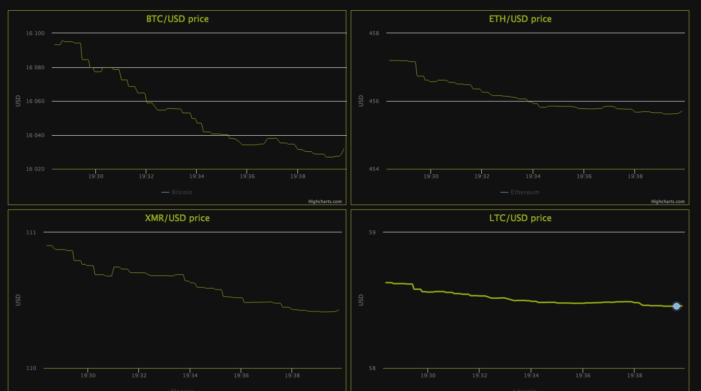

Cryprtocurrency data absorber

Fun project for learn how to work with cassandra and socket.io  
System consist of:
 data aquisition module - get data from api.coincap.io, parse it and store to Apache Cassandra database (Asset and Data models),
 socket.io server - prepare data for clients,
 charts page - socket.io client with Highcharts as Graph library
 
